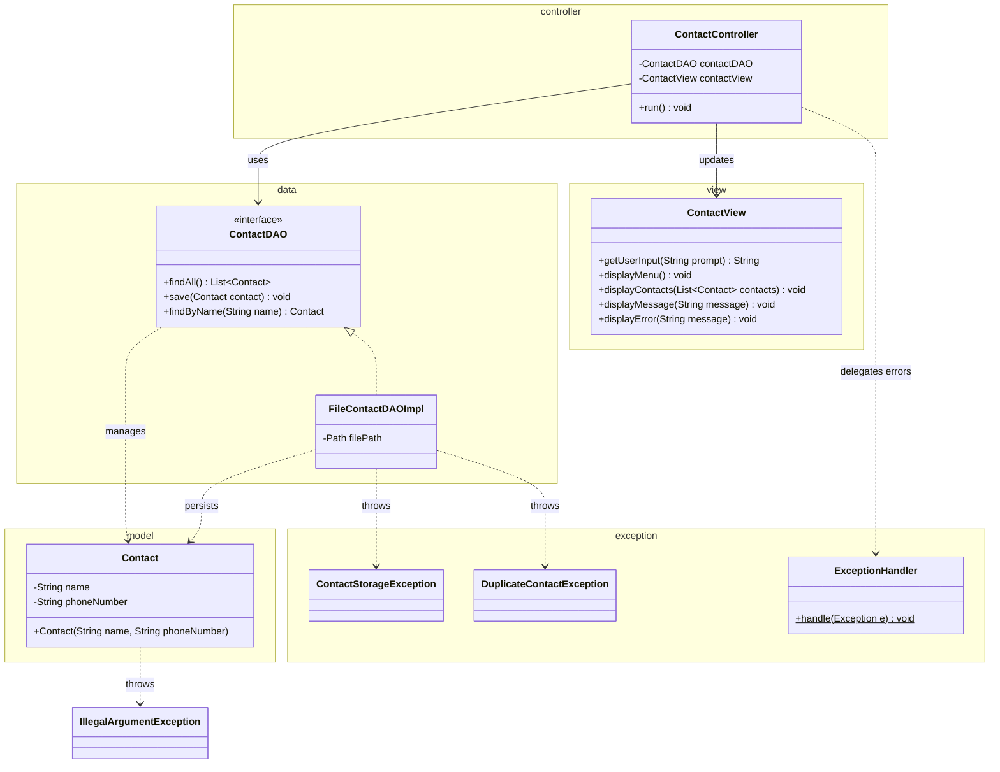

# Workshop: Contact App

## Objective
Build a Java application to manage contacts stored in a text file using advanced exception handling techniques.

## Learning Goals
*   Implement the application based on the provided Class Diagram.
*   Use **Unchecked Exceptions** for data validation.
*   Create and use **Custom Checked Exceptions**.
*   Apply **Try-with-Resources** for safe File IO.
*   Implement a **Centralized Exception Handler**.

---

## Prerequisites & Submission
**Task:** Setup your environment and prepare for submission.

1.  **Create Maven Project:** Create a new Maven project in your IDE.
    *   **Group Id:** `se.lexicon`
    *   **Artifact Id:** `contact-app-workshop`
2.  **Version Control:** Initialize a Git repository for your project and push it to GitHub/GitLab.
3.  **Submission:** Share the link to your repository with your instructor once you have started or completed the workshop.

---

## Conceptual Model (Class Diagram)

The following diagram shows the relationship between the different layers of the application and how exceptions flow through them using the **MVC (Model-View-Controller)** pattern.

### Suggested Package Structure
*   **Model:** `model`
*   **Data:** `data`
*   **View:** `view`
*   **Controller:** `controller`
*   **Exception:** `exception`

---

## 1: The Model & Validation (Unchecked)
**Task:** Create the `Contact` class in the `model` package.

*   **Validation:** for fields in the setters and use in constructor, throw `IllegalArgumentException` if the input is invalid.
*   **Regex Validation:** Enhance the `Contact` constructor to validate the phone number format using a Regular Expression (e.g., `^\\d{10}$`).

## 2: Custom Exceptions (Checked)
**Task:** Define `ContactStorageException` and `DuplicateContactException` in the `exception` package.

## 3: The Data Layer (DAO)
**Task:** Implement `ContactDAO` and `FileContactDAOImpl` in the `data` package.

*   **Responsibility:** The DAO is strictly for data persistence. It should **never** print to the console. It only communicates through return values or **Exceptions**.

## 4: The View & Controller (MVC)
**Task:** Create the `ContactView` (in `view` package) and `ContactController` (in `controller` package).

*   **The View:** Responsible for all user interaction (`Scanner` and `System.out`).
*   **The Controller:**
    *   Coordinates between the View and the Model.
    *   Contains the `try-catch` loop.
    *   Catches exceptions from the Model/DAO and tells the View what to display.
*   **The App/Main class:** Simply initializes the components and starts the Controller.

## 5: The MVC Design Pattern
**Task:** Explain the MVC (Model-View-Controller) design pattern.

---